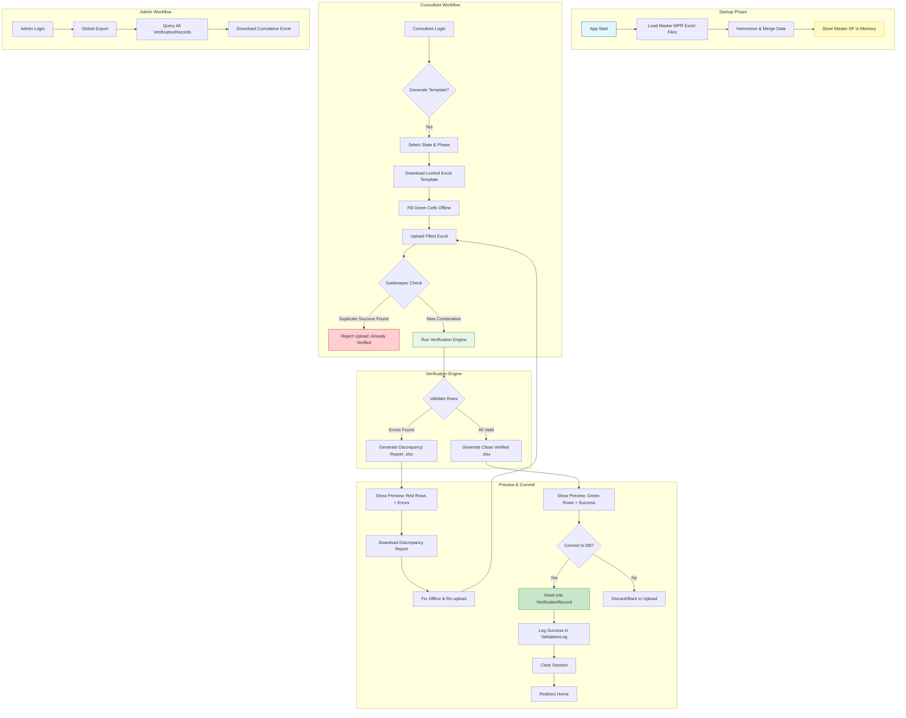

# UC Verification Portal - Developer Documentation

## 1. Project Overview

The **UC Verification Portal** is an internal web application designed to streamline the validation of Utilization Certificates (UCs) for RUSA and PM-USHA projects. It replaces manual Excel-based checks with an automated "All-or-Nothing" validation engine, ensuring financial integrity, ratio compliance, and auditability before data is committed to the master record.

### Key Features
- **Template Generation:** Auto-populates MPR data into locked Excel templates for consultants.
- **Automated Validation:** Checks State/Central share ratios, approval matches, and fund flow logic (Released ≥ Utilized).
- **Gatekeeper Logic:** Prevents duplicate successful validations for the same State/Phase combination.
- **Audit Trail:** Logs every upload attempt and stores verified records with user attribution.
- **Admin Export:** Allows administrators to download a global cumulative report of all verified UCs.

---

## 2. System Architecture

The application follows the **Flask Application Factory Pattern** with a service-oriented backend and server-side rendered frontend (Jinja2 + Bootstrap 5).

### Tech Stack
- **Backend:** Python 3.9+, Flask, SQLAlchemy (SQLite), Flask-Login
- **Data Processing:** Pandas, Openpyxl
- **Frontend:** HTML5, Jinja2, Bootstrap 5.3, DataTables.js (for preview tables)
- **Storage:** 
    - **Database:** `uc_audit.db` (SQLite) for users, logs, and verified records.
    - **File System:** `data/` directory for Master MPR files, temp uploads, and generated reports.
    - **Memory:** Master MPR DataFrame loaded into `app.config` on startup for fast read access.

### Directory Structure

```text
uc-verification-exercise/
├── app/
│   ├── __init__.py          # App factory, DB init, MPR loading
│   ├── models.py            # SQLAlchemy Models (User, Log, Record)
│   ├── routes/
│   │   ├── __init__.py
│   │   ├── auth.py          # Login/Logout/User Management
│   │   └── verifier.py      # Core Verification Routes
│   ├── services/
│   │   ├── config.py        # State Ratios & Canonicalization Logic
│   │   ├── mpr_loader.py    # ETL for RUSA/PM-USHA Excel files
│   │   ├── template_generator.py # Creates locked Excel templates
│   │   └── verification_engine.py # The "Brain": Validation Logic
│   └── templates/           # Jinja2 HTML Templates
├── data/
│   ├── master/              # Source MPR Excel Files
│   ├── temp/                # Uploaded files during processing
│   ├── review/              # Generated Discrepancy Reports
│   └── verified/            # Generated Clean Excel Files
├── logs/                    # Application Logs
├── run.py                   # CLI Commands & Entry Point
├── requirements.txt
└── DEVDOCS.md               # This file
```

---

## 3. Data Flow & Process Diagram

The following Mermaid diagram illustrates the end-to-end workflow from Template Generation to Final Commit.



---

## 4. Database Schema

### `User`
Manages access control.
| Column | Type | Description |
| :--- | :--- | :--- |
| `id` | Integer | Primary Key |
| `username` | String(50) | Unique Login ID |
| `password_hash` | String(128) | Werkzeug Hash |
| `role` | String(20) | `'consultant'` or `'admin'` |

### `ValidationLog` (The Gatekeeper)
Prevents duplicate successful submissions.
| Column | Type | Description |
| :--- | :--- | :--- |
| `id` | Integer | Primary Key |
| `state` | String(100) | Canonical State Name |
| `phase` | String(50) | RUSA 1/2 or PM-USHA |
| `status` | String(20) | `'Success'` or `'Failure'` |
| `timestamp` | DateTime | Time of upload |
| `user_id` | Integer | FK to User |

### `VerificationRecord` (The Master Data)
Stores the final audited financial figures.
| Column | Type | Description |
| :--- | :--- | :--- |
| `id` | Integer | Primary Key |
| `project_id_key` | String(255) | Unique Composite Key |
| `state_canonical` | String(100) | Normalized State |
| `rusa_phase` | String(50) | Scheme Phase |
| `component` | String(100) | Component Name |
| `inst_name` | String(255) | Institution Name |
| `uc_central_appr` | Float | UC Central Approved |
| ... | ... | *(Other Financial Columns)* |
| `timestamp` | DateTime | Commit Time |
| `user_id` | Integer | FK to User (Uploader) |

---

## 5. Installation & Setup

### Prerequisites
- Python 3.9+
- pip

### Steps

1.  **Clone Repository & Install Dependencies**
    ```bash
    git clone <repo-url>
    cd uc-verification-exercise
    pip install -r requirements.txt
    ```

2.  **Prepare Data Directories**
    Ensure the `data/master/` folder contains:
    - `RUSA_MPR_March.xlsx`
    - `PM_USHA_MPR_March.xlsx`

3.  **Initialize Database & Folders**
    ```bash
    flask init-db
    ```
    *This creates `uc_audit.db` and folders: `data/temp`, `data/review`, `data/verified`, `logs`.*

4.  **Create Admin User**
    ```bash
    flask create-user admin secret123 --role admin
    ```

5.  **Run Development Server**
    ```bash
    flask run
    ```
    Access at `http://127.0.0.1:5000`

---

## 6. Core Logic Details

### A. The Gatekeeper (`process_upload`)
Before running the heavy verification engine, the system performs a pre-flight check:
1.  Reads the uploaded Excel file.
2.  Canonicalizes State names using `config.normalize_state_name`.
3.  Extracts unique `(State, Phase)` combinations.
4.  Queries `ValidationLog` for any existing `status='Success'` entries.
5.  **If found:** Rejects the entire upload immediately to prevent data duplication.

### B. Verification Engine Rules (`_check_row_rules`)
For each row, the engine validates:
1.  **Identity:** `project_id_key` must exist in Master MPR.
2.  **Ratio Shortfall:** 
    - Calculates `Expected State Release` based on `Central Release` and configured `CS:SS Ratio`.
    - Flags if `Actual State Release < Expected State Release`.
3.  **Approval Match:** Sum of UC Central + State Approved must match Master MPR Total Approved.
4.  **Flow Logic:** 
    - `Total Released <= Total Approved`
    - `Total Utilized <= Total Released`

### C. State Canonicalization
The `config.py` module handles messy state names (e.g., "U.P.", "Orissa", "NCT of Delhi") by mapping them to a single canonical string (e.g., "Uttar Pradesh", "Odisha", "Delhi") defined in `STATE_VARIANTS`.

---

## 7. API & Routes Reference

### Auth Blueprint (`/auth`)
| Method | Route | Description |
| :--- | :--- | :--- |
| GET/POST | `/login` | User authentication |
| GET | `/logout` | Session termination |

### Verifier Blueprint (`/`)
| Method | Route | Role | Description |
| :--- | :--- | :--- | :--- |
| GET | `/` | All | Dashboard / Home |
| GET | `/generate-template` | All | Form to select State/Phase |
| POST | `/download-template` | All | Generates & downloads Excel |
| GET | `/upload-uc` | All | File upload form |
| POST | `/process-upload` | All | Runs Gatekeeper + Engine |
| GET | `/preview` | All | Shows validation results |
| GET | `/download-discrepancy-report` | All | Downloads error Excel |
| POST | `/commit-verification` | All | Saves valid rows to DB |
| GET | `/admin/global-export` | Admin | Downloads all verified records |

---

## 8. Troubleshooting

### Issue: "Master DataFrame is empty"
- **Cause:** Missing source files in `data/master/`.
- **Fix:** Ensure `RUSA_MPR_March.xlsx` and `PM_USHA_MPR_March.xlsx` exist and have a sheet named `data`.

### Issue: "Upload Rejected: Already Verified"
- **Cause:** The State/Phase combination was previously committed successfully.
- **Fix:** Only Admins can override this by manually deleting the entry from `ValidationLog` in the database (not recommended for audit integrity) or contacting the developer to reset the log for that specific batch.

### Issue: "Ratio Configuration Missing"
- **Cause:** The `config.py` file does not have a ratio defined for the specific State/Component combination.
- **Fix:** Update `CS_SS_RATIOS` in `app/services/config.py` with the correct tuple `(central%, state%)`.

---

## 9. Future Enhancements
- **Role-Based Dashboard:** Different views for Consultants vs. Admins.
- **Bulk Override:** Admin interface to unlock specific State/Phase combinations for re-upload.
- **Email Notifications:** Alert consultants when discrepancies are found.
- **PostgreSQL Migration:** For higher concurrency if user base grows beyond 20.
